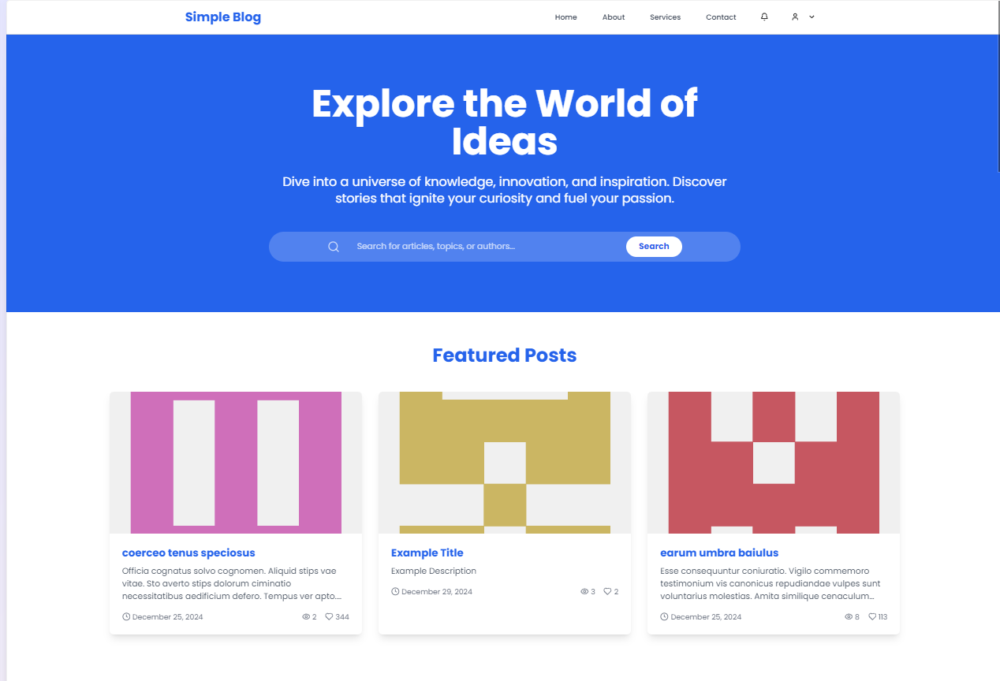
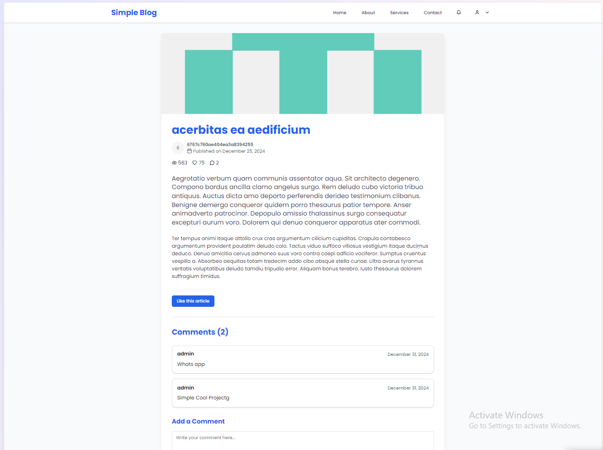
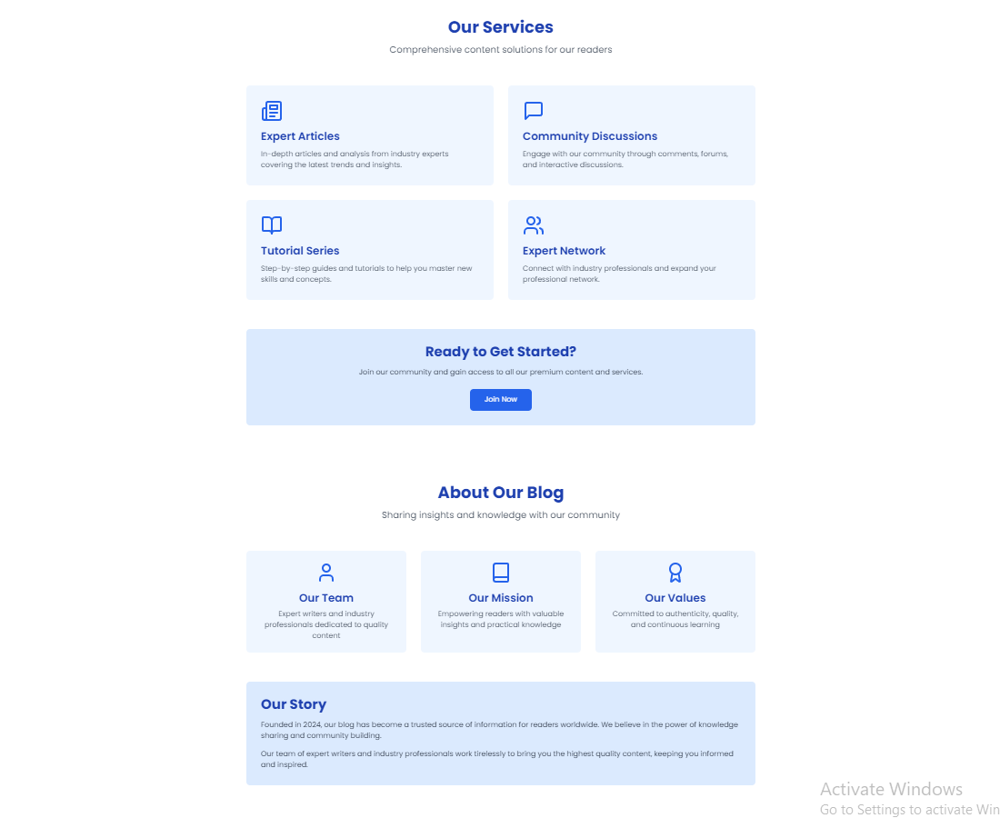

# Blog Project

It Simple Project That is create with the mern stack and the mvc  pattern and i really didnt care about the front end that much like the buttons bc it just simple project and here simple image that show the project





## how to start Running The Project
### backend 
Enter The Project Path
```
cd backend
```
To Install All node dependencies
```
npm install 
```
then to start the project 
```
npm run dev
```
And mange The env File. 
if you want to improve and generate data 
just go to route
```
localhost:3000/api/blog/factory/500
```
And Now You Finshed The Backend

### The Front End
To enter the Frontend file 
```
cd Frontend
```
To Install All node dependencies
```
npm install 
```
then to start the project 
```
npm run dev
```
then your good to do
